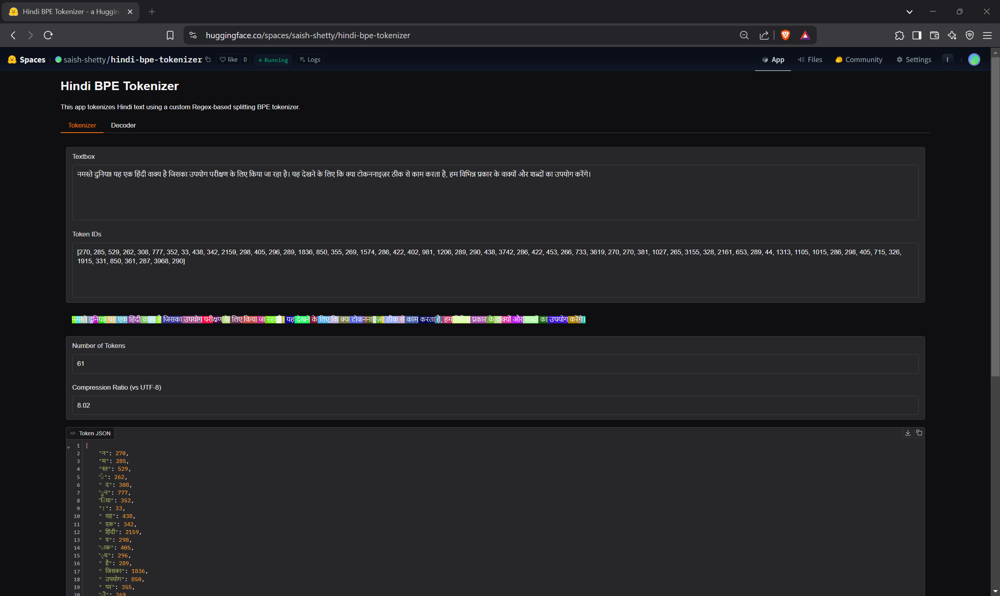
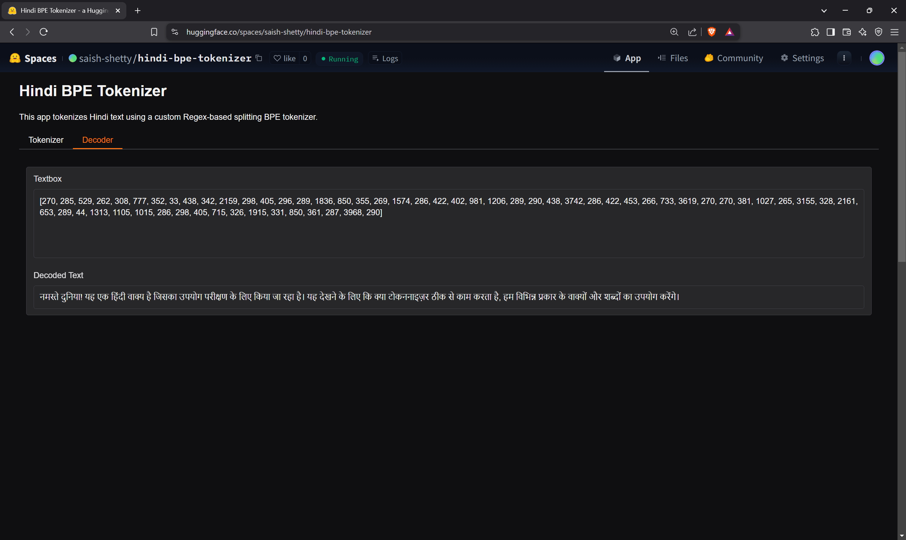

# Hindi Text Tokenizer App

This Gradio application tokenizes Hindi text using a custom regex-based Byte Pair Encoding (BPE) tokenizer. It provides a user-friendly interface to tokenize Hindi text, view the token IDs, calculate compression ratios, and decode token IDs back into text.

Check out the HuggingFace App: [Hindi BPE Tokenizer](https://huggingface.co/spaces/saish-shetty/hindi-bpe-tokenizer)

### Training Stats
1. Vocabulary Size: <b>5500</b> ✅
2. Average Compression Ratio: <b>7.822</b> ✅
3. Training iterations: <b>5244</b> (First 256 tokens are Single Byte encodings) ✅


## Overview

The application consists of the following key components:

*   **`app.py`:** The main application file that defines the Gradio interface and handles the tokenization and decoding logic.
*   **`hindi_tokenizer/`:** A directory containing the custom tokenizer implementation.
    *   **`__init__.py`:**  An empty file that makes the `hindi_tokenizer` directory a Python package.
    *   **`base.py`:** Contains the base class for the tokenizer.
    *   **`regex.py`:** Contains the `RegexTokenizer` class, which inherits from the base tokenizer and implements tokenization using regular expressions.
*   **`hindi_tokenizer.model`:** The trained BPE model file.
*   **`hindi_tokenizer.vocab`:** The vocabulary file containing the tokens and their corresponding IDs.
*   **`hindi_openai_input.txt` & `hindi_wikipedia_articles.txt`:** Text files used for training the tokenizer.
*   **`README.md`:** This file, providing documentation for the application.

## Tokenization Process

The tokenization process involves the following steps:

1.  **Input Text:** The user provides Hindi text as input through the Gradio interface.
2.  **Regex Splitting:** The `RegexTokenizer` splits the input text into initial tokens based on a predefined regular expression pattern. This pattern is designed to separate words, punctuation, and other meaningful units in Hindi text. The pattern is defined as:

    ```python
    pattern = r"(?i:[sdmt]|ll|ve|re)|\s?[\u0900-\u0963\u097A-\u097F]+|[\u0966-\u096F]{1,3}|[\d]{1,3}|\s?[a-zA-Z]+|[।.,!?;:\"'(){}[\]-\u0964\u0965]|[^\s\w\u0900-\u097F]|\s*[\r\n]|\s+(?!\S)|\s+"
    ```

    This regex handles:

    *   English contractions
    *   Hindi characters
    *   Hindi numerals
    *   English words
    *   Punctuation
    *   Special characters
    *   Whitespace
3.  **BPE Encoding:** The initial tokens are then encoded using the BPE model. The BPE model iteratively merges frequent pairs of tokens into new tokens, creating a vocabulary of subword units.
4.  **Token IDs:** Each token is assigned a unique ID based on the vocabulary.
5.  **Output:** The application provides the following outputs:
    *   **Tokenized Text (Highlighted):** The input text is highlighted, with each token displayed in a different color.
    *   **Number of Tokens:** The total number of tokens generated.
    *   **Compression Ratio (vs UTF-8):** The ratio of the length of the UTF-8 encoded input text to the number of tokens. This provides an indication of how well the tokenizer compresses the text.
    *   **Token JSON:** A JSON representation of the tokens and their corresponding IDs.

## Setup and Usage

1.  **Clone the repository:**

    ```bash
    git clone https://github.com/shettysaish20/Hindi-BPE-tokenizer-app
    cd Hindi-BPE-tokenizer-app
    ```

2.  **Install dependencies:**

    ```bash
    pip install gradio
    ```

3.  **Run the application:**

    ```bash
    python app.py
    ```

4.  **Access the Gradio interface:** Open the URL provided by Gradio (usually `http://127.0.0.1:7860/`) in your web browser.

5.  **Tokenize Text:** Enter Hindi text in the "Tokenizer" tab, and the tokenized output, number of tokens, compression ratio, and JSON data will be displayed.

6.  **Decode Token IDs:** Copy the list of token IDs from the "Tokenizer" tab, paste it into the "Decoder" tab, and the decoded text will be shown.

## Customization

*   **Regular Expression Pattern:** You can customize the regular expression pattern in `regex.py` to change how the text is initially split into tokens.
*   **BPE Model Training:** You can train your own BPE model using a different corpus of Hindi text or by adjusting the training parameters.
*   **Gradio Interface:** You can customize the Gradio interface by adding or modifying components, changing the layout, or adding new features.


## App Snapshots

### Tokenizer Tab



### Decoder Tab

